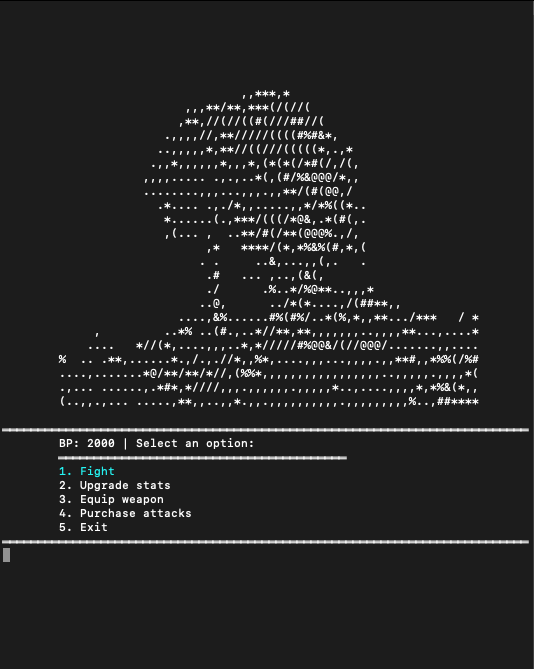
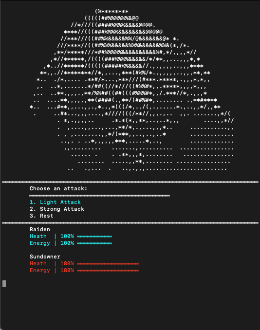

# Description
	This project involved bringing a role-playing game (RPG) to life by creating a fully functioning user experience using only the C# console. This required implementing various features and mechanics of an RPG game such as character creation, inventory management, combat system, quest tracking, and character progression.
	
	To accomplish this, the project involved designing and implementing different classes and functions to handle different aspects of the game's functionality. This would have required careful planning and organization to ensure that all the components worked together seamlessly.
	
    In addition to the technical aspects of the project, creating a fully functioning user experience would have also involved designing and implementing a user interface that was easy to navigate and provided all the necessary information to the player.

# Screenshots

    </img>
    </img>

